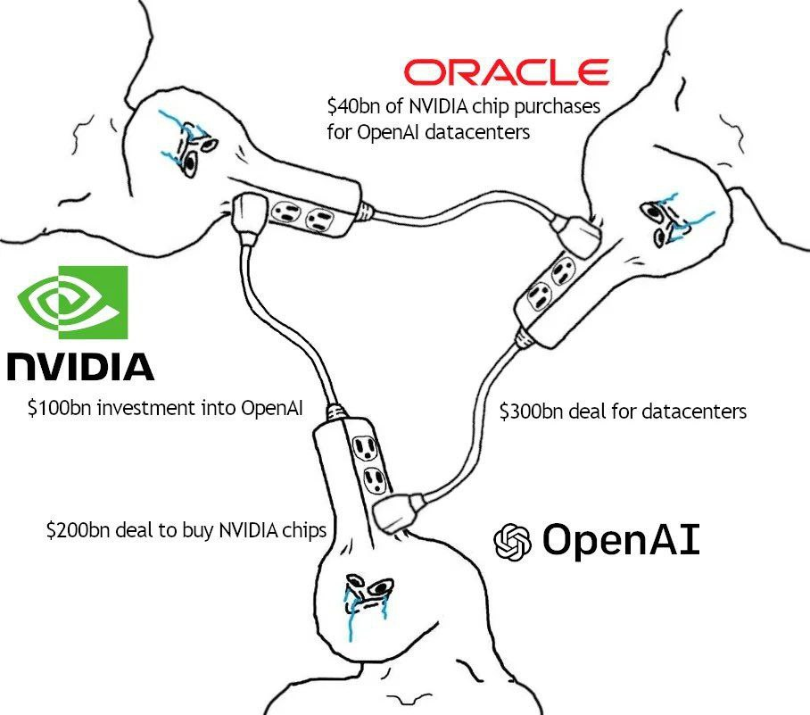
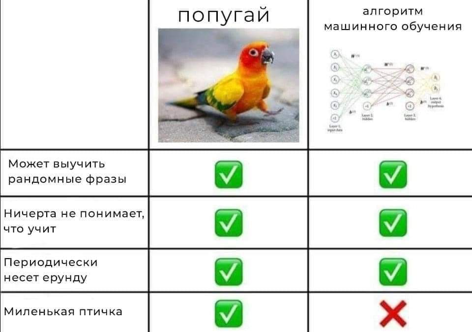

# Прикладные системы и фреймворки искусственного интеллекта

| Фамилия Имя     |      Группа |
|:----------------|------------:|
| Федоров Алексей | М8О-409Б-22 |

## Данные
1. Классификация: [COVID-19 Dataset](https://www.kaggle.com/datasets/meirnizri/covid19-dataset)
2. Регрессия: [Medical Insurance Cost Prediction](https://www.kaggle.com/datasets/rahulvyasm/medical-insurance-cost-prediction)

Скачанные датасеты расположены в папке [datasets](datasets).

## Лабораторные работы
Выполненные работы расположены в папке [notebooks](notebooks).

## Мемы
(а почему бы и да)\

